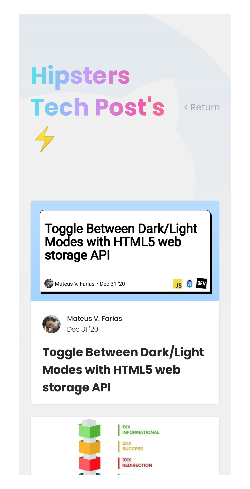

<p float="center">
  
  
  
</p>

## Table of Contents

- [Tech](#Tech)
- [Getting Started](#Getting-Started)
- [Usage](#Usage)
  - [GitHub](#GitHub)
    - [Get a user](#Get-a-user)
    - [List repositories for a user](#List-repositories-for-a-user)
  - [DEV Community](#DEV-Community)
    - [List articles for a user](#List-articles-for-a-user)
- [Contributing](#Contributing)
- [License](#License)

## Tech

- [TypeScript](https://github.com/microsoft/TypeScript) - TypeScript is a superset of JavaScript that compiles to clean JavaScript output.
- [React](https://reactjs.org) - A JavaScript library for building user interfaces.

> This project was bootstrapped with [Create React App](https://create-react-app.dev/docs/getting-started/#creating-a-typescript-app).

## Getting Started

1. To run this project in the development mode, you'll need to have a basic environment with NodeJs and Yarn installed;

2. Clone this repository:

```
git clone https://github.com/fariasmateuss/community-user-profile.git
```

3. In the project directory, install all dependencies:

```
yarn
```

4. Runs the app in the development mode:

```
yarn start
```

5. And finally open [http://localhost:3000](http://localhost:3000) to view it in the browser;

The page will reload if you make edits. <br />
You will also see any lint errors in the console.

## Usage

Getting started add your username in the [USERNAME_KEY](https://github.com/fariasmateuss/community-user-profile/blob/fdeb1264e3f21ffe96c2e45c8ca105200c6c853a/src/constants/params.ts#L1) variable.

| key          | description                     | default         |
| ------------ | ------------------------------- | --------------- |
| USERNAME_KEY | Username used in REST Endpoints | `fariasmateuss` |

In this project, there are requests for the following [GitHub](https://docs.github.com/en/rest) and [DEV Community](https://docs.dev.to/api/) REST endpoints.

### GitHub

#### `Get a user`

Provides publicly available information about someone with a GitHub account.

```
curl https://api.github.com/users/{USERNAME_KEY}
```

#### `List repositories for a user`

Lists public repositories for the specified user.

```
curl https://api.github.com/users/{USERNAME_KEY}/repos
```

### DEV Community

#### `List articles for a user`

Lists articles for the specified user.

```
curl https://dev.to/api/articles?username={USERNAME_KEY}
```

## Contributing

You can send how many PR's do you want, I'll be glad to analyse and accept them! And if you have any question about the project...

Connect with me at [LinkedIn](https://www.linkedin.com/in/fariasmateuss/)

Thank you!

# License

Made with ♥ by Mateus V. Farias

This project is under the [MIT License](/LICENSE)
