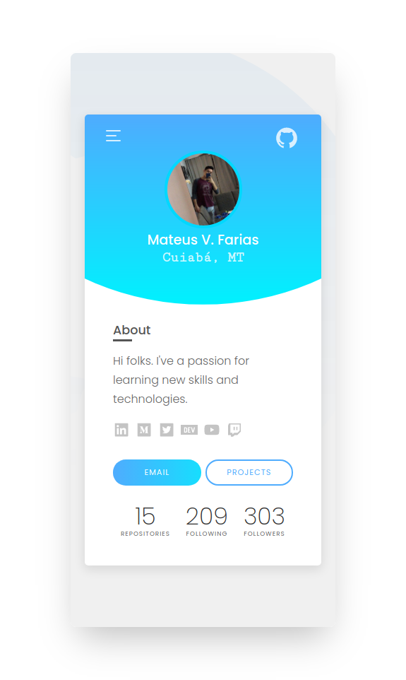

# Profile
My personal website consuming GitHub API

<p>
  <a aria-label="Hosting with Vercel" href="https://fariasmateuss.vercel.app/">
    
  </a>
</p>

## Tech

- [TypeScript](https://github.com/microsoft/TypeScript) - TypeScript is a superset of JavaScript that compiles to clean JavaScript output.
- [ReactJs](https://reactjs.org) - A JavaScript library for building user interfaces.
  - [React Icons](https://react-icons.github.io/react-icons/) - Utilizes ES6 imports that allows you to include only the icons that your project is using.
  - [React Router Dom](https://github.com/ReactTraining/react-router/tree/master/packages/react-router-dom) - DOM bindings.
- [Axios](https://github.com/axios/axios) - Promise based HTTP client for the browser and NodeJs.
- [Prettier](https://prettier.io/docs/en/cli.html) - An opinionated code formatter.
- [ESlint](https://eslint.org) - ESLint statically analyzes your code to quickly find problems.

## Development setup

### Prerequisites

To run this project in the development mode, you'll need to have a basic environment with NodeJs and Yarn installed.

#### Cloning the Repository

```
git clone https://github.com/fariasmateuss/profile.git
```

### Installing

Run to install the dependencies;

```
yarn
```

To start the project;

```
yarn start
```

## Feedback

You can send how many PR's do you want, I'll be glad to analyse and accept them! And if you have any question about the project...

Connect with me at [LinkedIn](https://www.linkedin.com/in/fariasmateuss/)

Thank you!

# License

[MIT License](/LICENSE)
