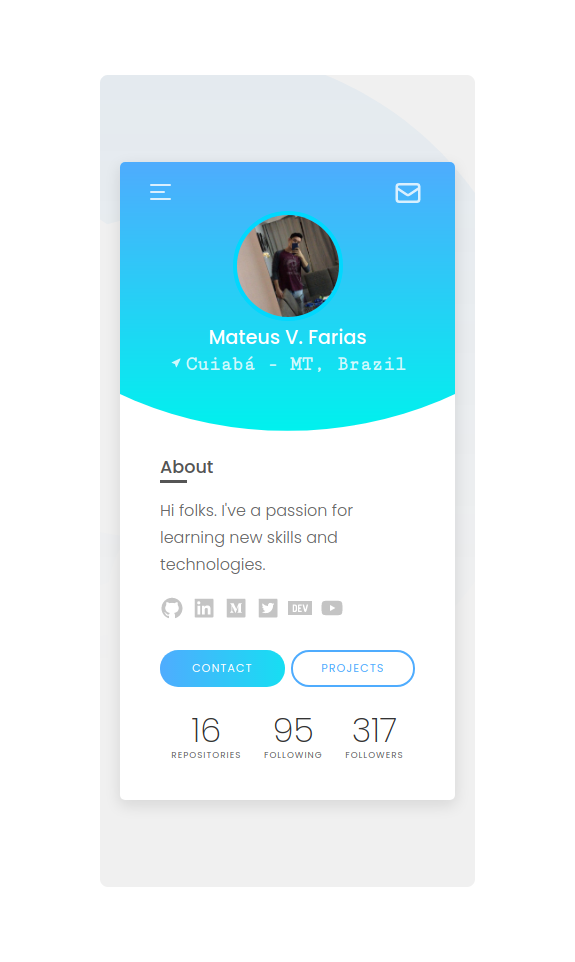

# GitHub Profile Concept

<p>
  <a aria-label="Hosting with Vercel" href="https://fariasmateuss.vercel.app/">
    
  </a>
</p>

## Tech

- [TypeScript](https://github.com/microsoft/TypeScript) - TypeScript is a superset of JavaScript that compiles to clean JavaScript output.
- [React](https://reactjs.org) - A JavaScript library for building user interfaces.

## Usage

This project was bootstrapped with [Create React App](https://create-react-app.dev/docs/getting-started/#creating-a-typescript-app).

## Development setup

To run this project in the development mode, you'll need to have a basic environment with NodeJs and Yarn installed.

#### Cloning the Repository

```
git clone https://github.com/fariasmateuss/profile.git
```

#### Installation

In the project directory, you can run:

To install the dependencies package.

```
yarn
```

Runs the app in the development mode.

```
yarn start
```

Open [http://localhost:3000](http://localhost:3000) to view it in the browser.

The page will reload if you make edits.<br>
You will also see any lint errors in the console.

## API

[Github](https://developer.github.com/v3/) REST API.

### Endpoints

Requests to the following REST endpoints.

#### `Get a user`

Provides publicly available information about someone with a GitHub account.

`https://api.github.com/users/{username}`

#### `List repositories for a user`

Lists public repositories for the specified user.

`https://api.github.com/users/{username}/repos`

## Feedback

You can send how many PR's do you want, I'll be glad to analyse and accept them! And if you have any question about the project...

Connect with me at [LinkedIn](https://www.linkedin.com/in/fariasmateuss/)

Thank you!

# License

[MIT License](/LICENSE)
